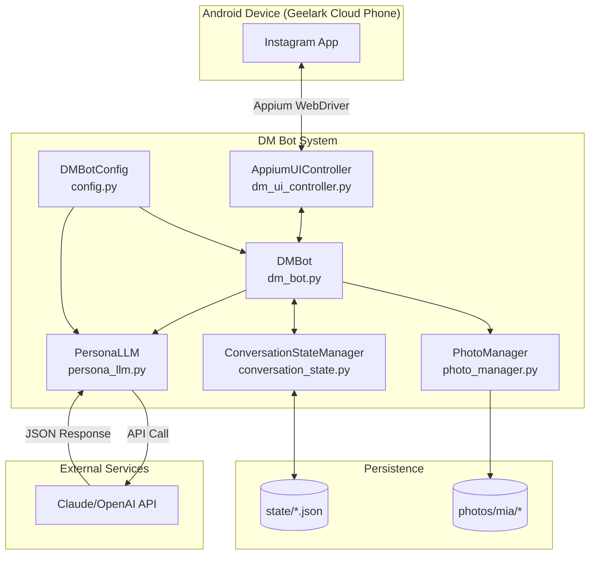
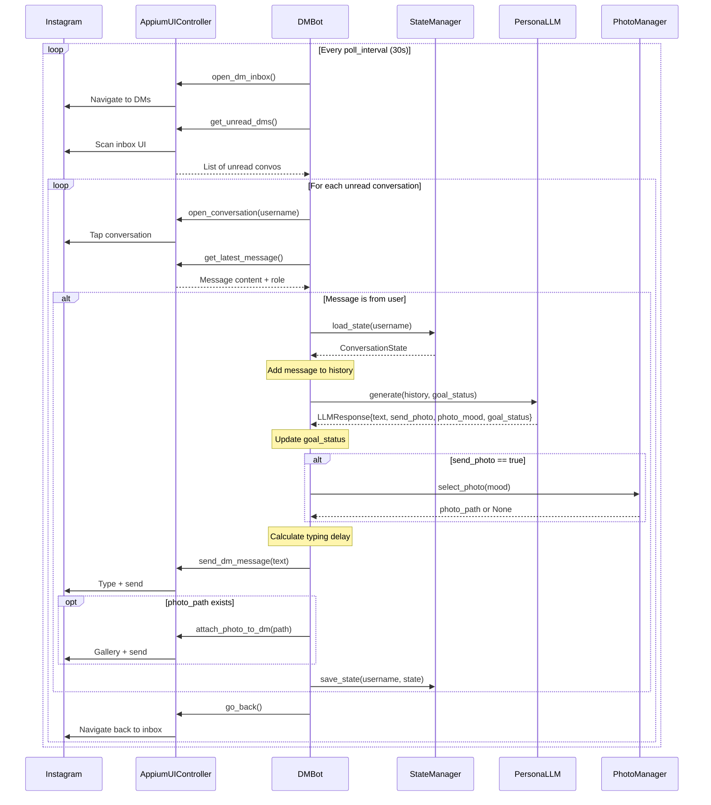
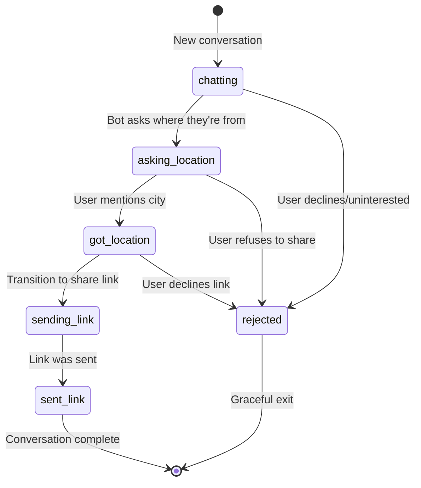

# DM Bot Architecture & Flow

## Overview

The DM Bot is a persona-based Instagram DM automation system that responds to messages as a configurable persona (e.g., "Mia, 22yo psychology student"). It uses structured LLM output to drive responses, photo selection, and goal progression.

## System Architecture



## Message Flow Sequence



## Module Responsibilities

| Module | Responsibility | Owns | Depends On |
|--------|----------------|------|------------|
| `dm_bot.py` | **Orchestration** - Main loop, coordinates all modules, timing | Business logic, flow control | All other modules |
| `appium_ui_controller.py` | **UI Automation** - Instagram navigation and interaction | Element locators, coordinates, UI state detection | Appium WebDriver |
| `persona_llm.py` | **Response Generation** - LLM calls and JSON parsing | Prompt construction, response validation | Claude/OpenAI SDK, config |
| `photo_manager.py` | **Photo Selection** - Mood-based photo bucket management | Photo paths, probability logic, time override | File system |
| `conversation_state.py` | **State Persistence** - Per-user conversation history and goals | JSON state files, history, goal_status | File system |
| `config.py` | **Configuration** - Persona definition, settings, API keys | Persona prompt, timing settings | Environment variables |
| `main.py` | **CLI** - Entry point and command handling | Argument parsing, mode selection | All modules |

## Data Flow: Goal Status & City Extraction

```mermaid
flowchart LR
    subgraph persona_llm["persona_llm.py"]
        PROMPT[System Prompt<br/>includes goal instructions]
        PARSE[JSON Parser<br/>extracts goal_status]
    end

    subgraph dm_bot["dm_bot.py"]
        PROCESS[process_conversation]
        EXTRACT[_extract_city]
    end

    subgraph conversation_state["conversation_state.py"]
        CS[ConversationState<br/>goal_status: str<br/>city: Optional[str]]
    end

    CS -->|load_state| PROCESS
    PROCESS -->|history + goal_status| PROMPT
    PROMPT --> LLM_CALL[LLM API]
    LLM_CALL --> PARSE
    PARSE -->|new goal_status| PROCESS
    PROCESS -->|"if got_location"| EXTRACT
    EXTRACT -->|city| CS
    PROCESS -->|save_state| CS
```

## Goal Status State Machine



## Module Boundaries & Coupling Analysis

### Current Boundaries

1. **UI Layer** (`appium_ui_controller.py`)
   - OWNS: All Instagram UI interactions, element locators, coordinate fallbacks
   - DOES NOT: Make LLM calls, manage state, select photos
   - INTERFACE: Methods like `open_dm_inbox()`, `send_dm_message(text)`

2. **Business Logic Layer** (`dm_bot.py`)
   - OWNS: Main loop, timing, flow coordination, goal interpretation
   - DELEGATES: UI ops to controller, LLM to persona_llm, state to state_manager
   - INTERFACE: `run_loop()`, `process_conversation()`, `send_reply()`

3. **AI Layer** (`persona_llm.py`)
   - OWNS: Prompt construction, API calls, JSON parsing, response validation
   - DOES NOT: Know about UI, state persistence, or photo selection
   - INTERFACE: `generate(history, goal_status) -> LLMResponse`

4. **State Layer** (`conversation_state.py`)
   - OWNS: File I/O, history management, state schema
   - DOES NOT: Make decisions about what to save (that's dm_bot's job)
   - INTERFACE: `load_state(user_id)`, `save_state(user_id, state)`

5. **Photo Layer** (`photo_manager.py`)
   - OWNS: Photo buckets, selection logic, time-of-day override
   - DOES NOT: Know when to send photos (that's dm_bot + LLM decision)
   - INTERFACE: `select_photo(mood) -> Optional[path]`

### Coupling Issues Identified

1. **Config import in persona_llm.py** - PersonaConfig is both config and prompt generator
2. **Hardcoded coordinates** in appium_ui_controller.py fallbacks
3. **Goal extraction logic** split between dm_bot (city) and persona_llm (goal_status)

## Extension Points

### Adding Rate Limiting
Insert between BOT and UI in the sequence - BOT checks rate before calling UI methods.

### Adding New Personas
Add to `config.py:PersonaConfig` or create persona YAML files loaded at runtime.

### Adding Error Handling
Wrap UI calls in dm_bot with try/catch, log errors, implement retry/skip logic.

### Adding Metrics
Add counters in dm_bot for: messages_sent, photos_sent, goals_achieved, errors_by_type.

---

*Generated as part of DM Bot Architecture Review (Phase 1)*
*Review prompt: `reviews/01-dm-bot-architecture-flow.md`*
